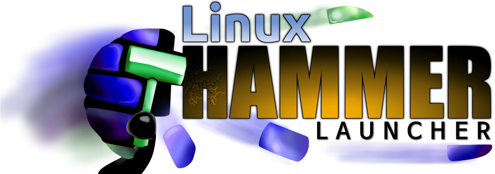
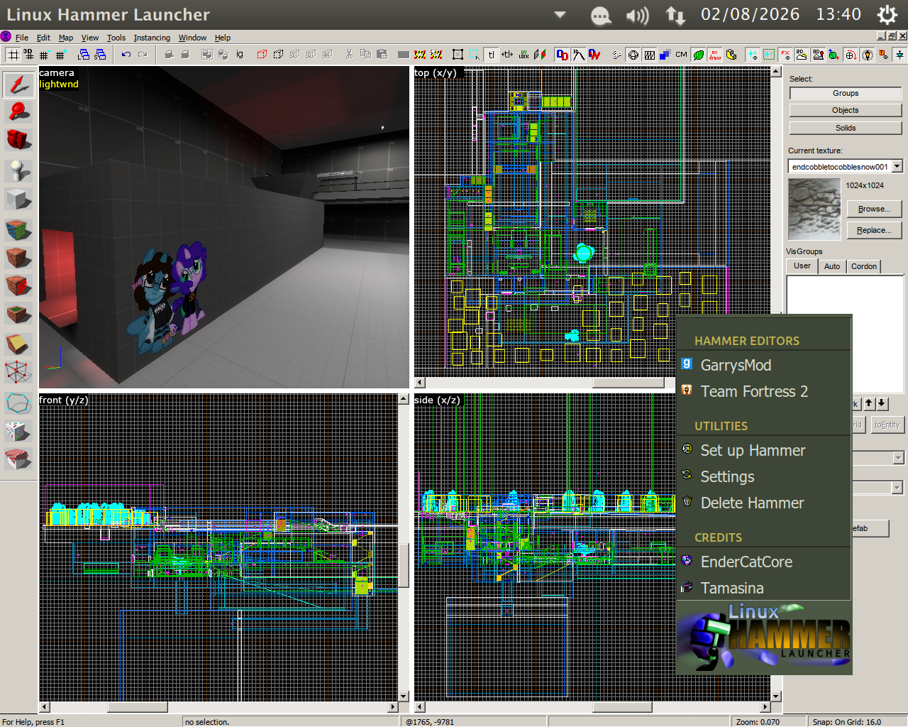
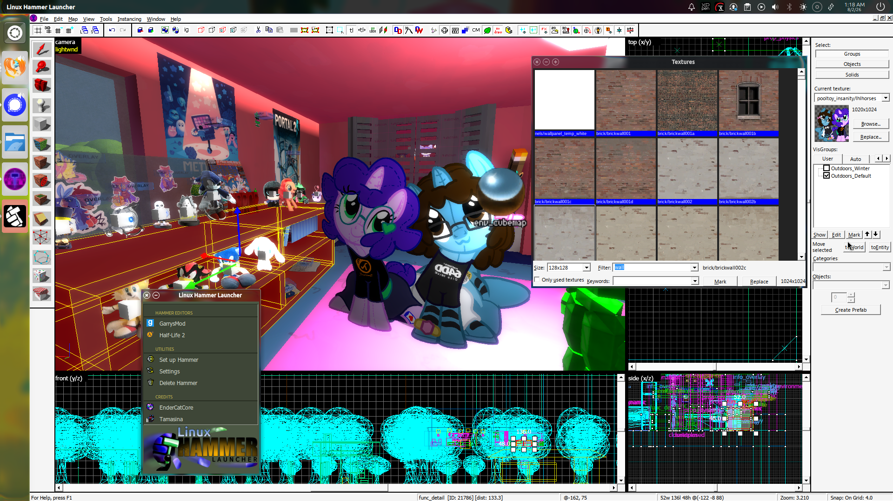

A launcher, installer and updater for [Hammer++](https://ficool2.github.io/HammerPlusPlus-Website/index.html) & [Tools++](https://ficool2.github.io/HammerPlusPlus-Website/tools.html) (VBSP++, VVIS++, VRAD++) on Linux, for many different Source Engine games.

Created by [EnderCatCore](https://endercatcore.neocities.org) & [Tamasina](https://tamasina.com).

<details>
<summary>Screenshots</summary>




</details>

## Prerequisites
- Wine *(while LHL automatically installs Wine 9, Wine is still required on your system for it to work properly)*
- Winetricks
- Libunwind8
- Zstd

You can install Wine & Winetricks on Debian-based distros by running these comamnds:
```
sudo apt update
sudo apt install wine winetricks libunwind8 zstd
```

Please note that immutable distros (such as SteamOS and Bazzite) will most likely **not** work with Linux Hammer Launcher. You can try, but don't be suprised if it won't launch or run correctly. 

## Game support
| Game | Works with Hammer++? | Has update detection? | Sets up Tools++? | Launches game on compile? | Launches map on compile? |
| :--- | :--: | :--: | :--: | :--: | :--: |
| Half-Life 2 | Yes | Yes | No | Yes | Yes |
| Half-Life 2: Episode 1 | Yes | Yes | No | Yes | No | 
| Half-Life 2: Episode 2 | Yes | Yes | No | Yes | No |
| Half-Life 2: Deathmatch | Yes | Yes | Yes | Yes | No |
| Half-Life: Deathmatch Source | Yes | Yes | Yes | Yes | No |
| Team Fortress 2 | Yes | Yes | Yes | Yes | No |
| Portal | Yes | Yes | Yes | Yes | Yes |
| Portal 2 | Yes | Yes | No | Yes | Yes |
| Garry's Mod **(x86-64 branch *****ONLY*****)** | Yes | Yes | Yes | Yes | Yes |
| Day of Defeat: Source | Yes | Yes | Yes | Yes | No |
| Left 4 Dead | **NO** | N/A | N/A | No | No |
| Left 4 Dead 2 | Yes | Yes | No | Yes | Yes |
| Counter-Strike: Source | Yes | Yes | Yes | Yes | No |
| Black Mesa | **NO** | N/A | N/A | No | No |

Any games that do **NOT** support Hammer++ MUST have the "Use vanilla Hammer in setup" option enabled or else it will not work.

If a game that supports launching on compile doesn't launch, it may be due to your Steam client being installed using Flatpak or that LHL couldn't find Steam.

---

If a game is not listed here, you can still try setting up Hammer/Hammer++ for it.
Don't be suprised if Hammer/Hammer++ does not run though.

## Running Linux Hammer Launcher
Go to [Releases](https://github.com/EnderCatCore/linuxhammerlauncher/releases/latest) and download the latest zip, and extract the zip anywhere.
Then give the Linux Hammer Launcher binary executable permissions, then open it to start the launcher.

If you can't change executable permissions using your file manager, try running this command in the LHL folder.

```
chmod +x ./Linux\ Hammer\ Launcher
```

## Cloning LHL from source
If you can't run Linux Hammer Launcher's binary version for any reason, or you want to modifiy LHL... you can run it from source.

### Prerequisites
Debian-based distros:
```
sudo apt update
sudo apt install git wine winetricks python3 python3-tk python3-requests python3-pip
python3 -m pip install crossfiledialog
```

### Running LHL from source
```
git clone https://github.com/EnderCatCore/linuxhammerlauncher.git
cd linuxhammerlauncher
python3 ./hammer_launcher.py
```

## Setting up a Hammer/Hammer++ instance
**BEFORE SETTING UP ANY GAME, YOU MUST LAUNCH IT ON STEAM AT LEAST ONCE FIRST! USING FRESH INSTALLS OF GAMES CAN CAUSE ISSUES.**

**IF YOU'RE MAPPING FOR THE ORIGINAL LEFT 4 DEAD OR BLACK MESA YOU MUST ENABLE THE VANILLA HAMMER OPTION IN THE SETTINGS BEFORE SETTING THEM UP!** 

**GARRY'S MOD REQUIRES THE x86-64 BRANCH TO BE ENABLED IN STEAM!**

You can set up a Hammer/Hammer++ instance by pressing the *Set up Hammer* button.

You will then be prompted to enter the game directory of the game you want to make maps for. You can do this by hitting the "Browse" button. If the "Browse" button doesn't work, you can copy and paste the path to the game into the textbox instead.

If you're not already using Proton for a game, you'll need to enable Proton for that game **temporarily** in Steam. This is so required files for Hammer to work is available.

To do that, right-click on the game in the game list, select **Properties**, choose **Compatability** in the popup dialog, enable the checkbox for forcing Steam Play, and set the dropdown to any Proton version.

Once you do so, close the popup and click on **Update**. Linux Hammer Launcher will automatically continue when it detects the needed files.

**NOTE:** If you're setting up Portal 2, Left 4 Dead or Left 4 Dead 2, you'll be also required to download the authoring tools for that game.
You can download and install the authoring tools for your game in Steam by searching for it in your library. 

If you're using a supported game, all setup from this point should be automatic. Hammer will auto launch itself at some points to help set itself up.

If not, you'll need to manually download Hammer++ for your game from the [official website](https://ficool2.github.io/HammerPlusPlus-Website/) and install it yourself.

Once Linux Hammer Launcher is done setting up, you can safely disable Proton by following the steps you did before for enabling Proton, but this time *disabling* the checkbox for forcing Steam Play.
 
You can now launch the Hammer/Hammer++ instance for your game. If an update is available for that Hammer++ instance, you will be asked if you want to install it. You can disable update prompts in the Settings.

## Deleting a Hammer/Hammer++ Instance
**WARNING!!! DELETING A HAMMER INSTANCE WILL COMPLETELY REMOVE EVERYTHING RELATED TO HAMMER++ AND DELETE THE ENTIRE BINWIN FOLDER USED BY LHL FOR THAT GAME. USE WITH CAUTION!**

If you're having any issues with a Hammer/Hammer++ instance, you can delete it entirely.

To do so, press the *Delete Hammer* button on the main menu. Linux Hammer Launcher will then enter Delete Mode.

Once you click on **ANY** Hammer/Hammer++ instance, it will ask you if you want to delete it. If you're sure, click *Continue*. Linux Hammer Launcher will automatically delete that instance for you.

You can then hit *Exit Delete Mode* to return to the main menu.

## Changing Settings

If you'd like to change some settings in Linux Hammer Launcher, you can do so by pressing the *Settings* button on the main menu.

---

| Setting | Options *(default marked in ***BOLD***)* | Only used during setup? |
| :--- | :---: | :---: |
| Use vanilla Hammer in setup | Yes/**NO** | **YES** |
| Disable Hammer++ update check | Yes/**NO** | No |
| Use 'mapsrc' folder instead of 'maps' folder | **YES**/No | **YES** |
| Current Theme | **VGUI**, SFM | No |

- Use vanilla Hammer in setup: If you don't want to use Hammer++, you can enable this to use the stock version of Hammer already included with your game. Please note that using this on games that already support Hammer++ is **not recommended** and you may run into issues.
- Disable Hammer++ update check: If you want to stay on a specific Hammer++ version, you can enable this to launch Hammer++ instances without being asked to update. **This applies to all instances of Hammer++.**
- Use 'mapsrc' folder instead of 'maps' folder: If you prefer your default VMF location to use the *maps* folder instead of the *mapsrc* folder, you can enable this before you set up a Hammer instance. **Disabling this may cause issues for some games.**
- Current Theme: Click on this to swap between the VGUI or SFM theme. 

---

Once you're done changing things to how you like, you can press the *Back* button to return to the main menu.
